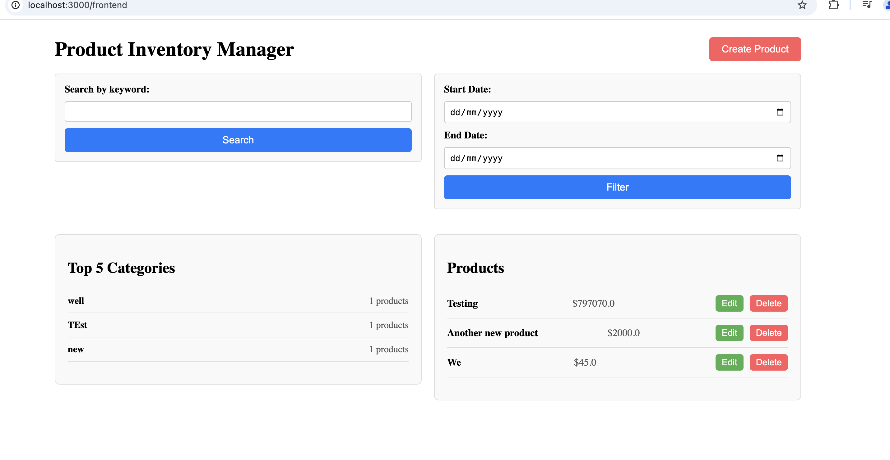
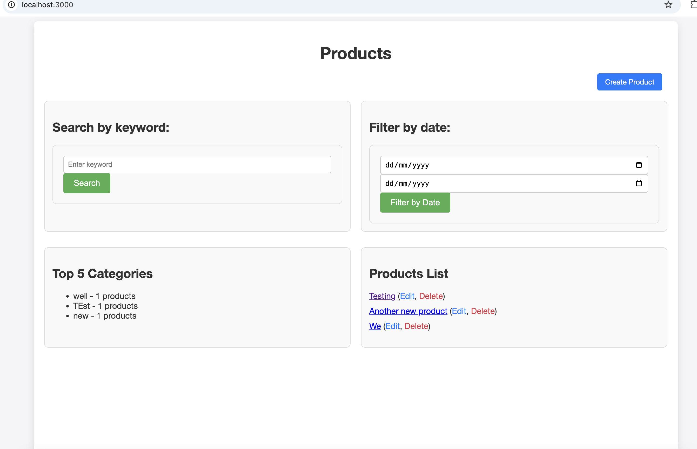

# Project Overview

This repository contains the code for the task, including both the API and the React frontend components.

## Highlights

- **API**: Comprehensive tests written using RSpec and Factory Bot.
- **Frontend**: Developed with React and custom JavaScript/CSS for faster implementation.
- **Screenshots**: Screenshots demonstrating the running application are included at the bottom of this file.

## Limitations and Points to Note

- Due to time constraints and other work commitments, full test coverage is currently only available for the API.
- I leveraged inline CSS and JavaScript within React components to speed up development.
- The React code, while functional, could be improved in the following areas:
  - Using `.env` files for managing API URLs.
  - Utilizing a more robust fetching methodology and integrating popular libraries for better state management and API handling.
- Time limitations prevented me from writing tests for the frontend and thoroughly testing every part of the code.

I am happy to discuss any part of the codebase, provide explanations, or share my thought process on the solutions I implemented. I can also offer detailed insights into improvements that could be made given more time.

## Screenshots

Below are screenshots of the running application:

---

Thank you for reviewing the project. Please feel free to reach out with any questions or feedback!